

<h2 style="font-size:50px; font-weight:bold; color:#166fe5;">AT Work 一站式智能云研发平台</h2>

 
<strong>🌟 项目简介</strong> 

&emsp;&emsp;AT Work 是武汉敖行客网络科技有限公司自研的云原生一体化研发协作平台，覆盖软件研发完整生命周期。传统研发团队普遍存在工具零散、本地环境配置繁琐、代码文档资产难管控、团队知识无法沉淀、跨部门沟通成本高等痛点。AT Work 将 云 IDE、项目管理、知识库、共享云盘、企业即时通讯、AI知识库六大能力整合为闭环协作体系，无需频繁切换多类工具，为开发、产品、测试、运维打造安全高效的 AI 研发工作空间。

<strong>🧩 核心功能模块</strong> 
1.登录

&emsp;&emsp;登录与注册

 
2.首页

&emsp;&emsp;首页是整个平台的数据概览以及每个功能模块的快捷入口

 
3. Coding 云 IDE 编程空间

&emsp;&emsp;基于浏览器的远程在线开发环境，完全兼容主流编辑器交互逻辑：Java、Python、Go、SpringBoot、Vue、React、C/C++、PHP 等12款主流开发语言与技术栈模板，秒级搭建开发环境，随时随地开始编码，CPU / 内存 / 磁盘资源可视化监控，算力弹性动态调配，数据全加密隔离存储 + 成员细粒度权限管控，网页、PC 客户端、手机APP多端数据互通。

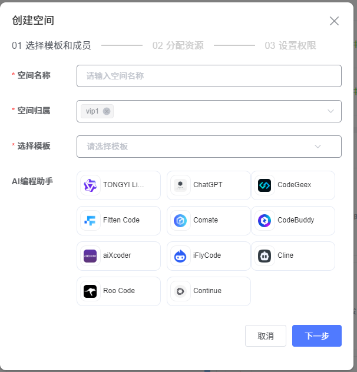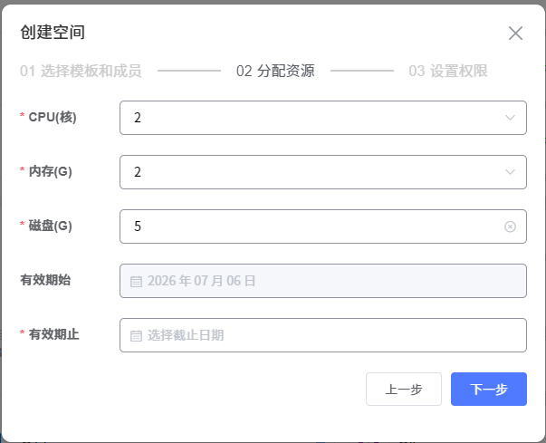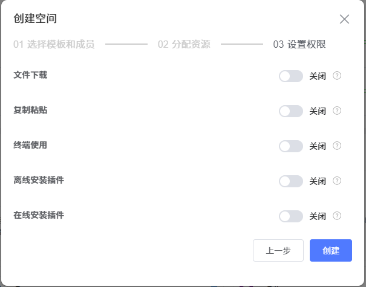

一键构建开发环境，兼容VSCode/IDEA操作习惯，内置十余款技术栈模板

 
4. Task 项目全生命周期协作 

&emsp;&emsp;覆盖需求管理、迭代规划、任务协同、缺陷闭环的全流程项目工具：需求统一收纳，支持自定义业务 / 产品需求流转工作流，自定义迭代周期、优先级排序、工时预估，进度百分比可视化展示，拖拽式看板视图，直观同步任务状态，清晰划分成员权责，自定义缺陷流转流程，实现问题提报 - 修复 - 验证全闭环质量管控，平台内部互通，任务可一键关联知识库文档、云盘文件、AI 知识库。

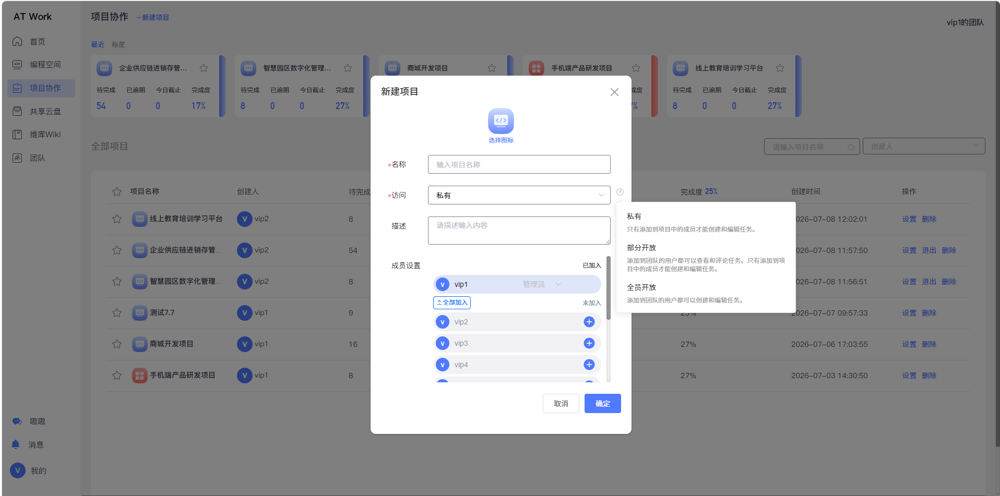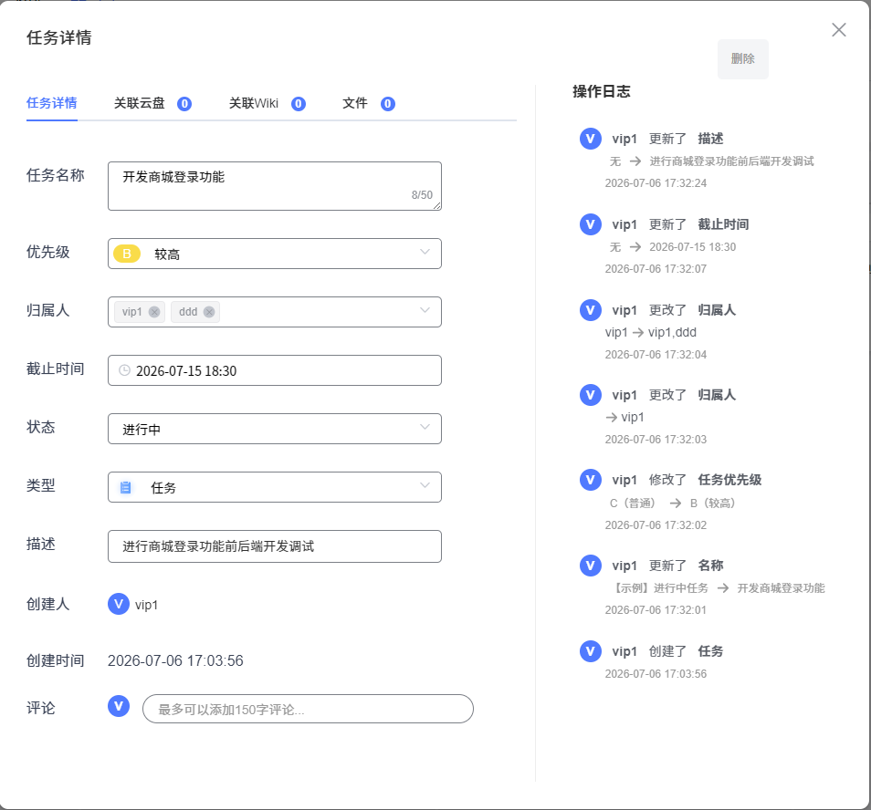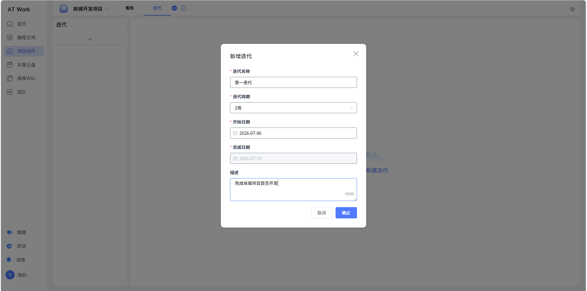

需求、迭代、任务、缺陷一站式敏捷管理，可视化跟踪项目进度

 
5. Wiki 团队知识库 

&emsp;&emsp;结构化在线协作文档系统，解决知识流失问题,多人实时在线编辑，内置常用文档模板，支持全局检索，文档自动归档、支持历史版本回滚，成员细粒度的权限控制

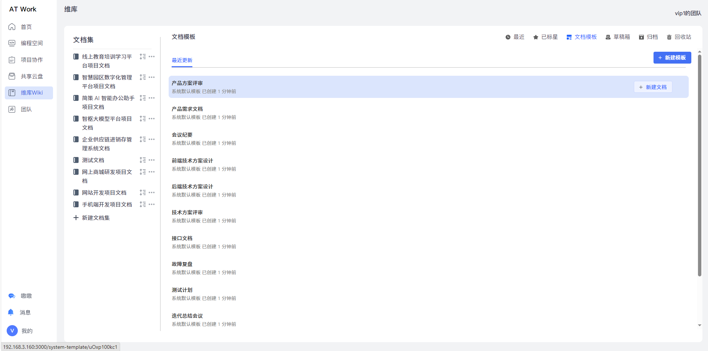

研发团队协同沉淀、安全可控的文档协作工具

 
6. Drawer 共享云盘 

&emsp;&emsp;面向研发场景的团队集中文件存储，多维权限隔离,多端实时同步查看，支持主流格式在线预览，批量移动、下载、删除、归档，分级权限管控，杜绝内部文件越权访问，文件可一键关联至项目任务、AI知识库。

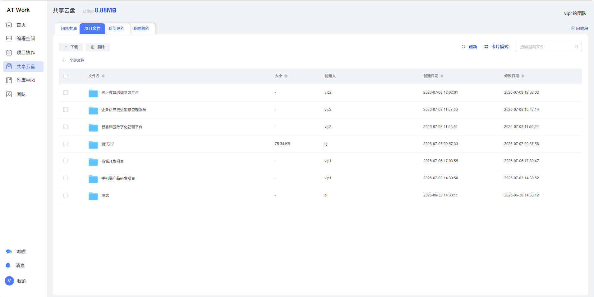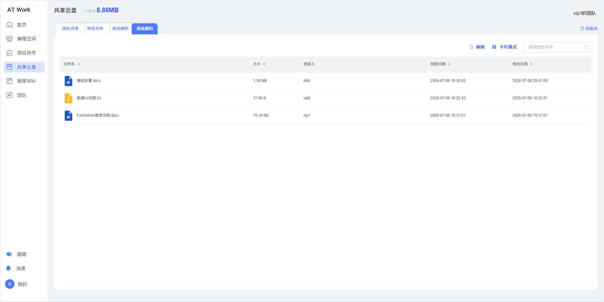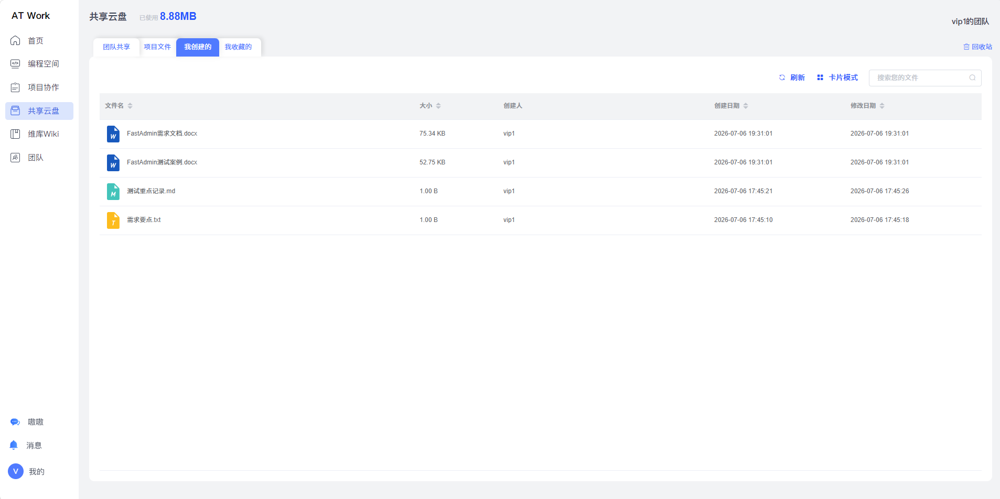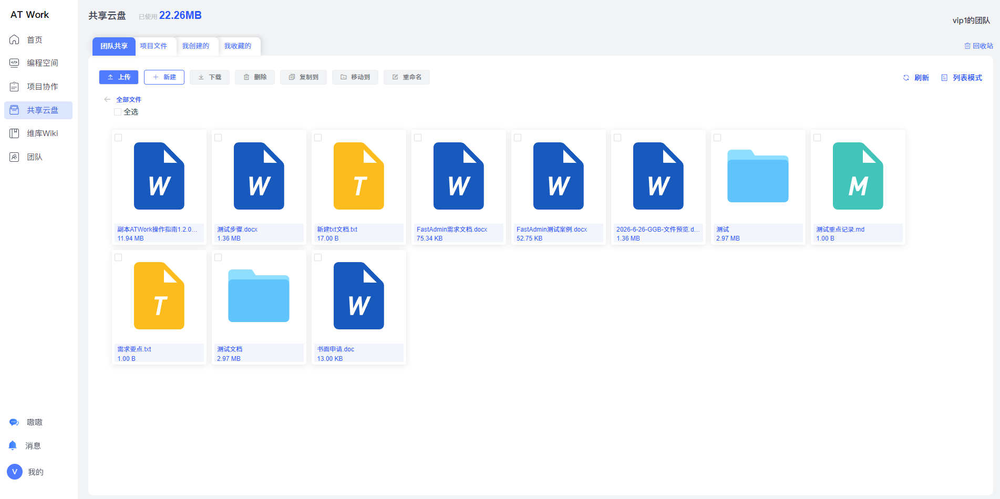

联动项目、AI知识库的安全可控的研发团队文件存储工具

 
7. IM（嗷嗷）即时通讯

&emsp;&emsp;专为研发场景打造的企业通讯工具，支持单人私聊、多人群组、高清语音、视频远程会议、投屏等功能，支持直接发送代码片段、项目文档、云盘文件，文件传输防护，并且将完整聊天记录永久留存可审计。

面向研发团队安全高效安全的内部沟通工具

 
8. 团队

&emsp;&emsp;管理团队成员，设置权限

 

 
8. 个人中心

&emsp;&emsp;设置个人信息及账号密码

 

 

<!--
6. 思链 AI 智慧中台

&emsp;&emsp;基于 RAG 检索增强的全平台 AI 赋能中心，兼容国内外主流大模型，支持本地私有化大模型接入部署，AI 能力覆盖代码生成、文档总结、需求拆解、技术难题问答，一键导入 Wiki、云盘文件，生成专属知识库。

AI赋能研发、智能检索的专属知识库

 
-->

<strong>🛡️ 双层全链路安全防护体系</strong> 
数据层防护：各模块数据物理隔离存储，避免跨业务数据泄露，代码、文档、附件全量加密持久化存储，加密传输协议，保障数据传输链路安全。 
应用层权限管控：平台全局统一总权限管控，每个功能模块独立精细化访问权限分配，完整用户操作日志留存，所有行为可追溯审计。 

<strong>🏗️ 底层技术架构</strong> 
核心架构：微服务 + K8S 容器化云原生部署，弹性扩容、高可用、易维护 
存储组件：PostgreSQL关系数据库、时序数据库、向量数据库、分布式缓存 
消息中间件：RabbitMQ，负责异步通知、任务调度 
AI 底层能力：文档切片、向量嵌入、大模型推理、RAG 检索增强生成 
部署方案：整体一键部署 / 单一模块独立拆分部署 

<strong>✨ 产品核心优势</strong> 
全场景无缝协同:一套平台覆盖编码、项目、文档、存储、沟通、AI 六大研发环节，无需切换多款第三方工具，大幅降低团队沟通成本。 
业数据与知识完全可控:双层安全防护 + 私有化部署方案，实现团队技术知识长期沉淀复用，杜绝数据外泄风险。 
全方位提升研发效率:秒级开发环境搭建、全链路 AI 辅助、自动化敏捷流程，缩短项目交付周期，降低人力成本。 
高拓展兼容能力:插件化架构 + 微服务拆分，适配独立开发者、小型团队、大型集团多类研发场景。 

<strong>📄 授权说明</strong> 
本仓库存放 AT Work 平台部署镜像配套文档、配置脚本。 
商用私有化镜像：需联系敖行客网络科技获取商业授权。 
演示镜像：仅用于学习、技术测试，禁止直接用于商用生产环境。 

<strong>📞 联系我们</strong> 
作者：[武汉敖行客网络科技有限公司](https://www.allthinker.com) 
产品：AT Work 智能一体化云研发平台 
